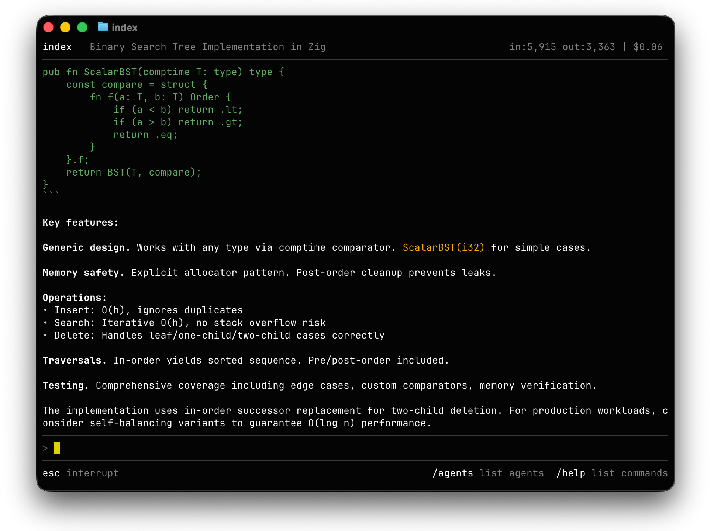

<p align="center">
  
</p>
<h1 align="center">Arbiter</h1>

<p align="center">
  <strong>A lean agent orchestration runtime and TUI.</strong>
</p>

<p align="center">
  <a href="LICENSE"></a>
  
</p>

Arbiter is a terminal-native multi-agent system built around token efficiency.  The orchestration layer — an agent named `index` — matches the model to the task and pairs cheap executors with smarter advisor models.  It runs a full-screen TUI with a persistent header, a command queue so you can type while agents are working, and a depth-limited delegation chain that lets the master agent dispatch tasks to specialists.



> **Note:** Arbiter is an experimental project. Changes to the architecture may break the experience. Agent constitutions and orchestration methods are currently subject to change. Arbiter's `/exec` commands are currently un-sandboxed. Use at your own risk.

## Install

### Homebrew (macOS)

```bash
brew tap tylerreckart/tap
brew install arbiter
```

### Build from source

```bash
cmake -B build -DCMAKE_BUILD_TYPE=Release
cmake --build build
sudo cmake --install build
```

Requires: OpenSSL, C++20 compiler, libedit or GNU readline (optional but recommended).

### Setup

```bash
export ANTHROPIC_API_KEY="sk-ant-..."   # Claude models
export OPENAI_API_KEY="sk-..."          # OpenAI models (optional)

# Initialize config directory, generate auth token, create example agents
arbiter --init

# Launch interactive TUI
arbiter
```

Set whichever keys you plan to use — only one is required. Keys can also be
written to `~/.arbiter/api_key` (Anthropic) or `~/.arbiter/openai_api_key` (OpenAI)
if you prefer file storage.

## Commands

### Conversation

| Command | Description |
|---------|-------------|
| `<text>` | Send to current agent |
| `/send <agent> <msg>` | Send to a specific agent |
| `/ask <query>` | Send directly to index(master) |
| `/use <agent>` | Switch current agent |

### Agents

| Command | Description |
|---------|-------------|
| `/agents` | List loaded agents |
| `/status` | System status and per-agent stats |
| `/tokens` | Full token usage breakdown with costs |
| `/create <id>` | Create agent with default config |
| `/remove <id>` | Remove agent |
| `/reset [id]` | Clear agent conversation history |
| `/model <agent> <model-id>` | Change agent model at runtime |

### Background Loops

Loops run an agent repeatedly in the background. The agent continues until it goes idle (two consecutive turns with no tool calls) or hits 20 iterations.

| Command | Description |
|---------|-------------|
| `/loop <agent> <prompt>` | Start agent in a background loop |
| `/loops` | List all running/suspended loops |
| `/log <id> [N]` | Show buffered output (last N entries) |
| `/watch <id>` | Tail loop output live (Enter to detach) |
| `/kill <id>` | Stop a loop |
| `/suspend <id>` | Pause a loop |
| `/resume <id>` | Resume a paused loop |
| `/inject <id> <msg>` | Send a message into a running loop |

### Tools

Agents issue these commands in their responses. The orchestrator executes them and feeds results back (up to 6 turns per message). You can also issue them directly as REPL commands.

| Command | Description |
|---------|-------------|
| `/fetch <url>` | Fetch a URL; HTML stripped to readable text |
| `/exec <shell command>` | Run a shell command; stdout+stderr returned |
| `/write <path>` | Write a file (content follows until `/endwrite`). Backs up existing files to `<path>.bak` before overwriting. |
| `/agent <id> <message>` | Invoke a sub-agent |
| `/advise <question>` | Consult the configured advisor model (see [Advisor model](#advisor-model)) |
| `/mem write <text>` | Append note to agent's persistent memory |
| `/mem read` | Load agent memory into context |
| `/mem show` | Print raw memory file |
| `/mem clear` | Delete agent memory |

Memory is stored per-agent at `~/.arbiter/memory/<agent-id>.md`.

## Agents

`arbiter --init` creates five example agents in `~/.arbiter/agents/`:

| Agent | Role | Notes |
|-------|------|-------|
| `index` | Orchestrator (built-in) | Routes tasks, delegates, synthesizes |
| `research` | Research analyst | Haiku executor + Opus advisor for cost efficiency |
| `reviewer` | Code reviewer | Ultra-brevity mode |
| `writer` | Content writer | Full prose mode, 8192 token cap, temp 0.7 |
| `devops` | Infrastructure engineer | Shell, git, Docker, CI/CD |
| `planner` | Task planner | Produces structured plan files with phase/dependency breakdown |

### Constitution format

Each agent is defined by a JSON file in `~/.arbiter/agents/`:

```json
{
  "name": "reviewer",
  "role": "code-reviewer",
  "personality": "Senior engineer. Finds fault efficiently.",
  "brevity": "ultra",
  "max_tokens": 512,
  "temperature": 0.2,
  "model": "claude-sonnet-4-6",
  "goal": "Inspect code. Identify defects. Prescribe remedies.",
  "rules": [
    "Defects first, style second.",
    "Prescribe the concrete fix, never vague counsel."
  ]
}
```

### Brevity levels

| Level | Style |
|-------|-------|
| `lite` | Full grammar, no filler. Professional prose. |
| `full` | Drop articles, fragments permitted. Field-report style. |
| `ultra` | Maximum compression. Abbreviations, arrows, minimal words. |

### Agent modes

Set `"mode"` in the constitution to change the base system prompt:

| Mode | Description |
|------|-------------|
| _(unset)_ | Standard index voice — compressed, declarative |
| `"writer"` | Full prose mode — complete sentences, format guidance, no compression |
| `"planner"` | Decomposition mode — structured plan output, always writes to file |

### Advisor model

The advisor pattern lets a cheap executor model call out to a smarter model for hard judgment calls — architectural tradeoffs, ambiguity resolution, multi-step planning. The executor handles bulk work at the cheap rate; the advisor only burns tokens when the reasoning actually warrants it.

Set `advisor_model` in the executor's constitution:

```json
{
  "model": "claude-haiku-4-5-20251001",
  "advisor_model": "claude-opus-4-6"
}
```

When `advisor_model` is set, the executor's system prompt gains a new capability:

```
/advise <question>
```

It emits this command in its response just like `/fetch` or `/agent`. The orchestrator fires a one-shot API call against the advisor model, returns the reply as a tool result, and the executor continues its turn.

- The advisor sees only the text the executor wrote after `/advise` — nothing from the prior conversation leaks in. This forces the executor to pose self-contained questions (state the decision being made, the constraints) and keeps advisor calls cheap and predictable.
- Routing is by model-string prefix, so executor and advisor can be on different providers. The canonical mix is a local executor (`ollama/gemma4:latest`) paired with a cloud advisor (`claude-opus-4-6`) — bulk tokens stay local and free, only the hard-reasoning turns hit the cloud meter. See [Model providers](#model-providers) below.
- The constitution layer caps consultation at two `/advise` calls per turn — a third desired consult means the task is under-scoped and the executor is told to deliver what it has and flag the open question.
- The advisor's tokens post to the *caller's* cost ledger using the advisor's model pricing. `/tokens` shows exactly which agent drove which advisor spend, even across providers.


## Model providers

Each agent's `model` field is routed by prefix:

| Prefix | Provider | Endpoint | Key source |
|---|---|---|---|
| `claude-*` (or any bare model id) | Anthropic | `api.anthropic.com` (TLS) | `ANTHROPIC_API_KEY` / `~/.arbiter/api_key` |
| `openai/<model>` | OpenAI | `api.openai.com` (TLS) | `OPENAI_API_KEY` / `~/.arbiter/openai_api_key` |
| `ollama/<model>` | Ollama (OpenAI-compat) | `$OLLAMA_HOST`, default `http://localhost:11434` | none |

Adding a new provider is a single entry in the registry table in `src/api_client.cpp` plus a body-builder / parser if the wire format differs; the rest of the orchestrator is format-agnostic.

### OpenAI

Prefix the model id with `openai/`:

```json
{
  "name": "reviewer",
  "model": "openai/gpt-4o-mini"
}
```

Supported families include `openai/gpt-5.4`, `openai/gpt-5`, `openai/gpt-4.1`, `openai/gpt-4o`, and the o-series reasoning models `openai/o3`, `openai/o4-mini`. Reasoning models automatically use `max_completion_tokens` and omit `temperature` (which they reject). OpenAI's implicit prompt caching is tracked in the cost footer as cache reads when the API reports `cached_tokens`.

### Ollama

Point an agent at a local model by prefixing the id with `ollama/`:

```json
{
  "name": "executor",
  "model": "ollama/qwen2.5-coder:14b",
  "advisor_model": "claude-opus-4-6",
  "max_tokens": 4096,
  "temperature": 0.3
}
```

The executor turns run entirely on your Ollama server (zero API cost); only `/advise` consults hit the cloud.

**Setup:**

```bash
**`OLLAMA_HOST` override** — set this before launching `arbiter` to point at a non-default Ollama server. Accepted forms:

- `http://host:port` — full URL (use `https://...` for TLS)
- `host:port` — assumes `http://`
- `host` — assumes port 11434
- unset — defaults to `http://localhost:11434`

```bash
export OLLAMA_HOST=http://gpu-box.local:11434
arbiter
```

**Caveats**

- Smaller models (≤14B) follow the `/exec` / `/write` / `/agent` text conventions less reliably than cloud providers. Expect occasional missed tool calls, looser adherence to brevity rules, and sloppier synthesis.
- Ollama turns don't benefit from cache discounts; the system prompt is re-sent each turn.
- Token usage is populated from Ollama's `usage` block when present. Some Ollama builds omit it — those turns will show `in:0 out:0` in `/tokens`.

## Server mode

```bash
arbiter --serve --port 9077
```

Accepts TCP connections. Clients authenticate with a SHA-256 hashed token generated by `arbiter --init` or `arbiter --gen-token`.

## One-shot mode

```bash
arbiter --send reviewer "review: if (arr.length = 0) return;"
```

## License

CC BY-NC 4.0
